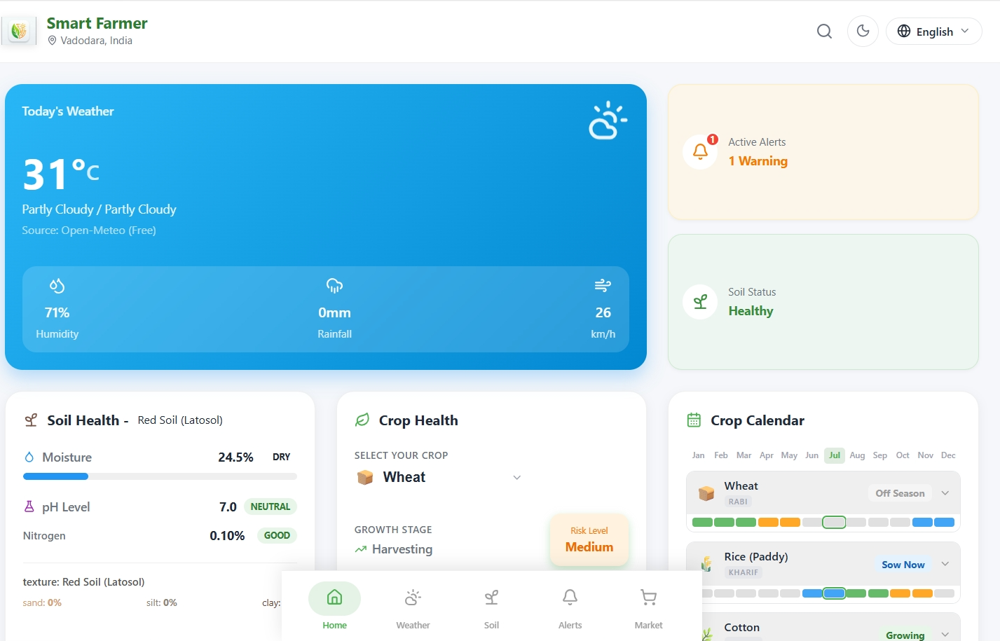
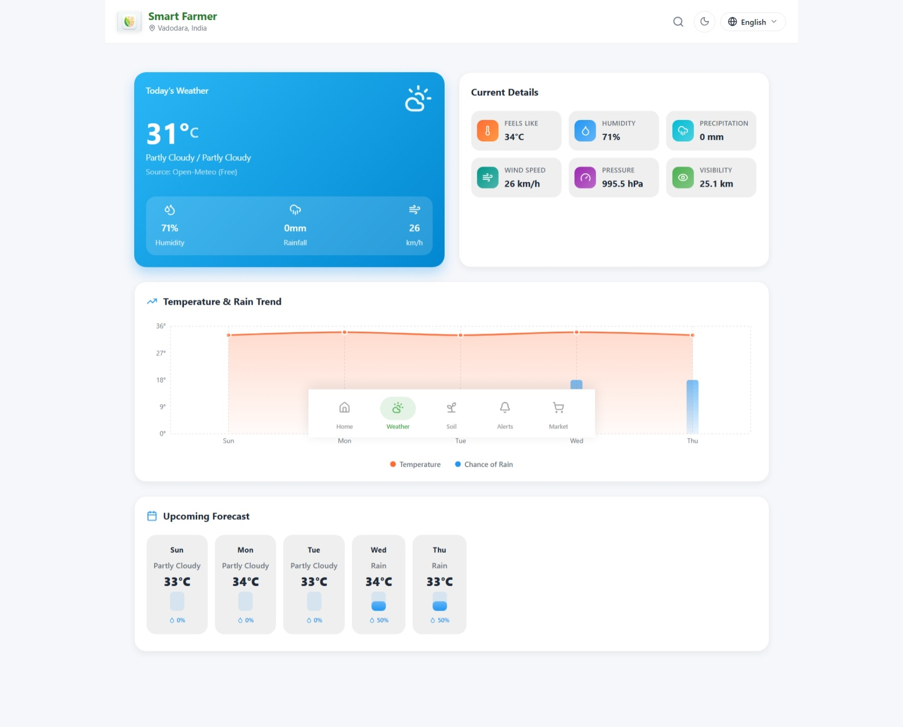
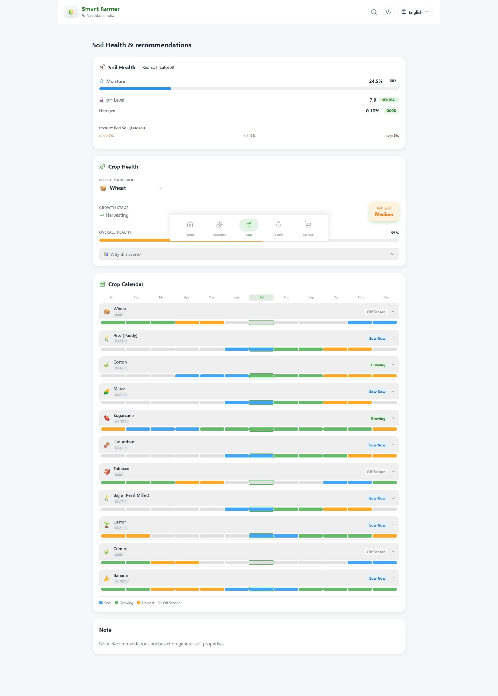
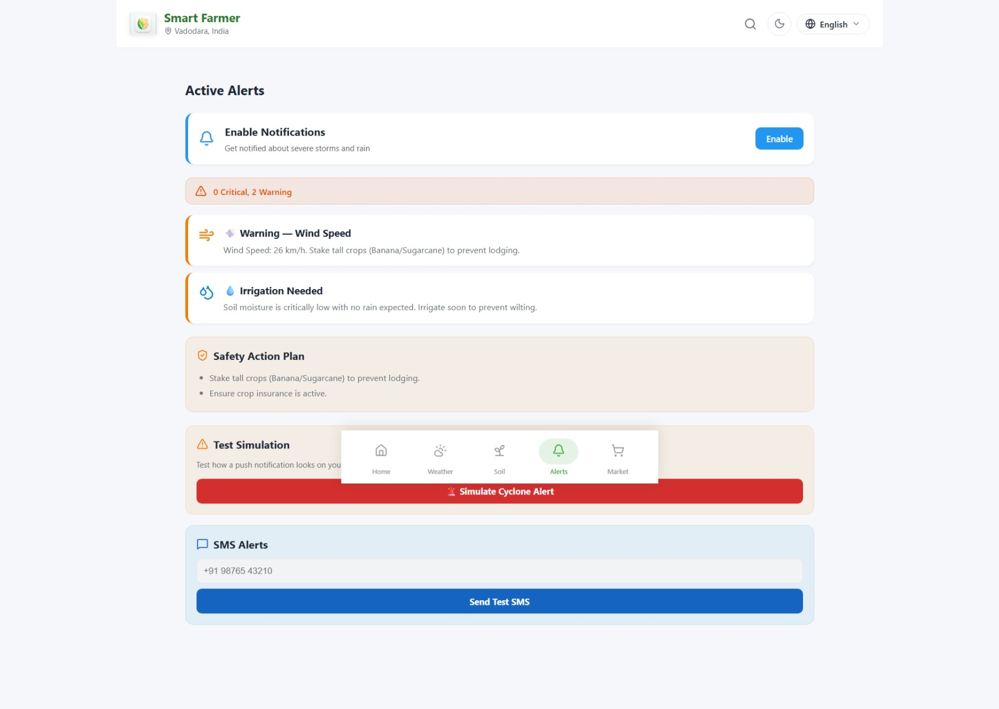
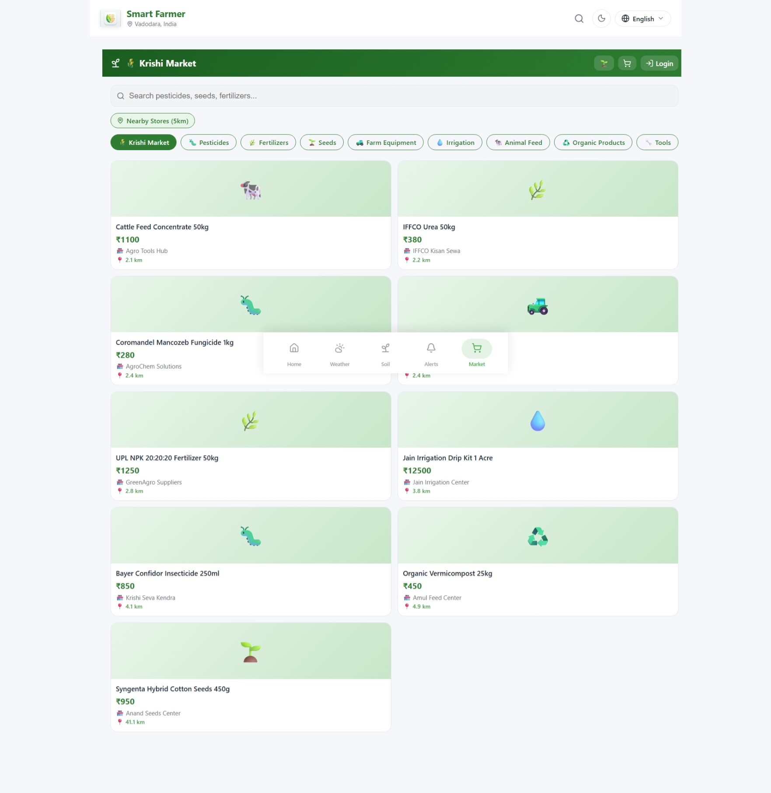

<div align="center">

# 🌾 Smart Farmer Dashboard Screenshots

### A real-time weather & farm intelligence dashboard built for farmers


| Dashboard | Weather | Soil |
|---|---|---|
|  |  |  |

 | Alerts | Market |
 |---|---|
 |  |  |
 

</div>

---

## 📖 About The Project

**Smart Farmer Dashboard** is a modern, responsive web application inspired by the *Smart Farmer* app, designed to give farmers a single, unified view of the data they need to make daily decisions — weather, soil health, crop health, and actionable alerts.

The app is built with a **pluggable weather-data layer** that can pull live data from multiple third-party weather providers, or fall back to realistic mock data so the UI is always demo-ready — even without API keys.

> 💡 Built to demonstrate front-end engineering, API integration architecture, and data-driven UI design for a real-world agri-tech use case.

---

## ✨ Features

| Feature | Description |
|---|---|
| ⛅ **Real-Time Weather** | Live temperature, condition, humidity, rainfall, and wind data |
| 🌱 **Soil Health Monitoring** | Tracks soil moisture and pH levels at a glance |
| 🌾 **Crop Health Tracking** | Displays growth stage and risk indicators for crops |
| 🚨 **Smart Alerts** | Simplified, farmer-friendly weather warnings and status updates |
| ✅ **Daily Action Items** | Auto-generated task list to guide the farmer's day |
| 🔌 **Multi-API Weather Engine** | Unified interface across multiple weather providers with automatic fallback to mock data |
| 📱 **PWA-Ready** | Configured as an installable, mobile-friendly web app |

---

## 🛠️ Tech Stack

- **Frontend:** React + Vite
- **Styling:** CSS
- **Weather Data Layer:** Unified service integrating [OpenWeatherMap](https://openweathermap.org/api), [WeatherAPI](https://www.weatherapi.com/), and [StormGlass](https://stormglass.io/)
- **Linting:** ESLint
- **Deployment:** Vercel

---

## 🚀 Live Demo

Check out the live, deployed version here:

### 👉 [web-scraping-data-analysis.vercel.app](https://web-scraping-data-analysis.vercel.app/)

---

## 📸 Preview

<div align="center">
<i>Add a screenshot or GIF of the dashboard here — this is the single highest-impact addition you can make to this README.</i>
</div>

```
📁 docs/
  └── preview.png   ← place a screenshot here and reference it below
```

```md

```

---

## ⚙️ Getting Started

### Prerequisites

- [Node.js](https://nodejs.org/) (v16 or higher recommended)
- npm

### Installation

1. **Clone the repository**
   ```bash
   git clone https://github.com/Tirth8292/web_scraping_data_analysis.git
   cd web_scraping_data_analysis
   ```

2. **Install dependencies**
   ```bash
   npm install
   ```

3. **Run the development server**
   ```bash
   npm run dev
   ```

4. Open [http://localhost:5173](http://localhost:5173) in your browser 🎉

---

## 🔑 Configuring Live Weather Data

By default, the app runs on **realistic mock data** so it works out of the box with zero configuration.

To connect real, live weather data, add your API keys in `src/services/weatherService.js`:

```js
const API_KEYS = {
  OPEN_WEATHER: 'YOUR_KEY_HERE',
  WEATHER_API: 'YOUR_KEY_HERE',
  STORM_GLASS: 'YOUR_KEY_HERE'
};
```

| Provider | Get an API Key |
|---|---|
| OpenWeatherMap | https://openweathermap.org/api |
| WeatherAPI | https://www.weatherapi.com/ |
| StormGlass | https://stormglass.io/ |

---

## 🗺️ Roadmap

- [ ] Add historical weather trend charts
- [ ] Multi-language support for regional farmers
- [ ] Push notifications for critical alerts
- [ ] Offline-first PWA caching for low-connectivity areas

Contributions and suggestions are welcome — see [Contributing](#-contributing) below.

---

## 🤝 Contributing

Contributions make the open-source community amazing. Any contributions are **greatly appreciated**.

1. Fork the project
2. Create your feature branch (`git checkout -b feature/AmazingFeature`)
3. Commit your changes (`git commit -m 'Add some AmazingFeature'`)
4. Push to the branch (`git push origin feature/AmazingFeature`)
5. Open a Pull Request

---

## 📄 License

Distributed under the MIT License. See `LICENSE` for more information.

---

## 👤 Author

**Tirth Shah**

- GitHub: [@Tirth8292](https://github.com/Tirth8292)
- Live Project: [web-scraping-data-analysis.vercel.app](https://web-scraping-data-analysis.vercel.app/)

<div align="center">

If you found this project useful, consider giving it a ⭐ on GitHub!

</div>
